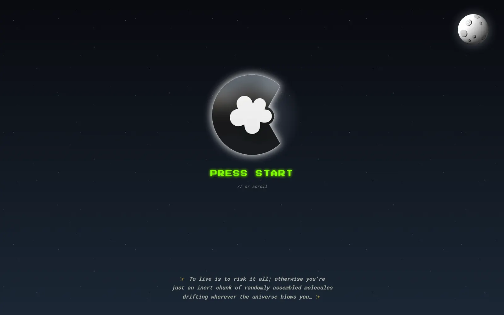
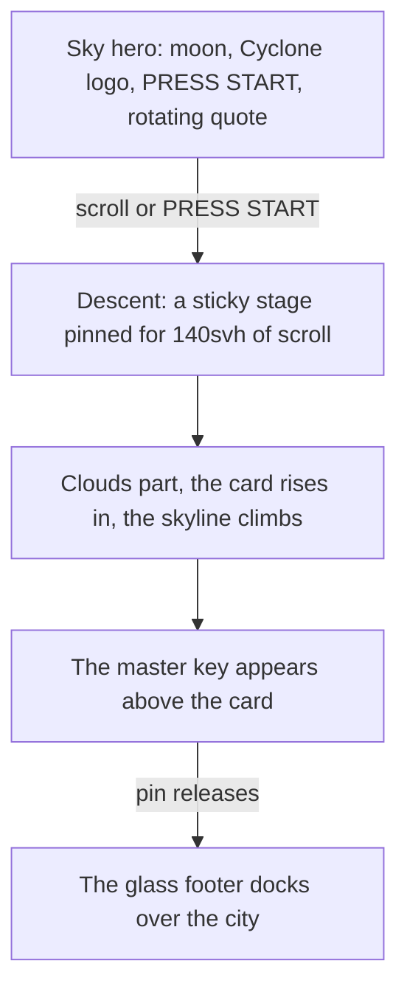

# johnKeysCloud

Personal calling card for the founder of
[Cyclone Studios](https://www.cyclonestud.io/), live at
[johnkeys.cloud](https://www.johnkeys.cloud).



There's no project list. The site is the work: one page, a night sky, a
descent through the clouds to a card, and a few things to find along the way.
This README is for anyone who wants to see how it's put together.

Built with Next.js 16, React 19, TypeScript, and SCSS modules. Those, plus
`sass`, are the only runtime dependencies.

## How the page works



The descent is driven by how far you've scrolled through its pinned stretch:

| Progress      | What happens                                         |
| ------------- | ---------------------------------------------------- |
| 0 to 12%      | Hold. The clouds stay closed.                        |
| 12 to 88%     | Clouds part, the card rises in, the skyline climbs.  |
| 88% and up    | The master key is revealed.                          |
| After the pin | The footer glass rises and the city sinks behind it. |

The page itself is three components: [`Sky`](src/components/Sky),
[`Descent`](src/components/Descent), and
[`SiteFooter`](src/components/SiteFooter), put together in
[`src/app/page.tsx`](src/app/page.tsx). The scroll ranges live in
[`src/styles/_descent.scss`](src/styles/_descent.scss).

## Notable details

### Scroll-driven animation, with a fallback

The descent runs on a CSS view timeline (`view-timeline-name: --descent`), so
the browser keeps it in step with scrolling. On iOS, scroll-event updates lag
behind a touch scroll, and the timeline sidesteps that. Browsers without
scroll timelines get the same motion from a small requestAnimationFrame loop
that writes a `--cloud-part` custom property, and only listens while the
section is on screen. The CSS keyframes are written to match the fallback's
formula, and [`src/lib/descent.ts`](src/lib/descent.ts) mirrors the Sass
ranges so the two paths agree. With no JS and no timeline support, the card
still shows.

See [`Descent.tsx`](src/components/Descent/Descent.tsx) and
[`Descent.module.scss`](src/components/Descent/Descent.module.scss).

### The quote carousel

Each quote bursts into letters and springs back together: an anticipation
curve on the way out, an overshooting spring on the way in, and a direction
per letter based on where it sits relative to the quote's center. Text is
split with `Intl.Segmenter` so emoji stay whole. Screen readers get the full
quote in one piece, and the letters are hidden from them. Reduced motion swaps
the physics for a plain fade.

The order is shuffled once per page load behind `useSyncExternalStore` with a
`null` server snapshot, so prerendering and hydration show no quote rather
than one that gets swapped out. The hold timer only counts down while the
quote is on screen and the tab is visible. See
[`Epigraph.tsx`](src/components/Epigraph/Epigraph.tsx).

### Still frames first

The Cyclone logo and the moon are animated WebPs of 1.2 MB and 670 KB. Each
one paints its few-KB still frame immediately, and the animation is laid over
it once it has downloaded and decoded. The still's `src` never changes, so
the page's largest paint is the small file. The logo's floating loop waits in
its opening pose until the animation is in, so the swap lands at the still's
size. Visitors who prefer reduced motion never download either animation.

See [`useAnimatedImage.ts`](src/lib/useAnimatedImage.ts) and
[`_animated-overlay.scss`](src/styles/_animated-overlay.scss).

### Pixel art drawn on the server

The New York skyline and the clouds are generated in code rather than
shipped as images, and neither ships any client JavaScript.

- [`Skyline/geometry.ts`](src/components/Skyline/geometry.ts) builds the
  city on an art-pixel grid, looking east across the Hudson. Landmarks like
  the Empire State, Chrysler, and One World Trade Center are placed by hand,
  and a seeded Park–Miller generator fills in the rest so the server and
  client draw the same city. Window lights sit in their own SVG so their
  flicker doesn't repaint the silhouette's neon glow.
- [`Clouds/cloudRaster.ts`](src/components/Clouds/cloudRaster.ts) turns a
  union of circles into an outlined pixel cloud, shaded along its underside,
  and merges the pixels into horizontal SVG runs.

### The eclipse

Tap the moon. The Cyclone mark crosses it as the new moon, the sky dims and
shows its stars, and a corona flares with "diamond ring" glints at second
and third contact. The quote picks up a glow at totality through
`:has([data-eclipsing])`. One constant, `ECLIPSE_MS` in
[`src/lib/eclipse.ts`](src/lib/eclipse.ts), sets both the CSS duration and
the reset timer. Under reduced motion it holds a still totality for the same
span instead.

See [`Moon`](src/components/Moon) and
[`Sky.module.scss`](src/components/Sky/Sky.module.scss).

### The footer signature

Hold the pointer on the "powered by" logo through two passes of its flourish
and a signature surfaces like a thought bubble. A touch can't hover, so on
phones a tap starts the countdown and a tap outside the pane ends it. The
state lives in `data-egg-dwelling` and `data-egg-revealed` attributes, and the
reveal only animates transforms and opacity, so nothing reflows. See
[`FooterPane.tsx`](src/components/SiteFooter/FooterPane.tsx).

### Haptics

The moon, the key, PRESS START, and the contact form give a light buzz
through the Vibration API. Safari has none, so on iPhone
[`iosHaptic.ts`](src/lib/iosHaptic.ts) borrows the system tick that iOS 18
plays when a native switch toggles. It's unofficial, kept to one file so it's
easy to remove. All haptics are skipped under reduced motion. See
[`haptics.ts`](src/lib/haptics.ts).

### Accessibility

- Landmarks: the sky is the `<header>`, the card is `<main>`, and the handle
  is the `<h1>`.
- Buttons and links share one `engaged` mixin: keyboard focus mirrors hover,
  and hover is gated behind `(hover: hover)` so a tap doesn't leave a control
  stuck in its hover state. See
  [`_interaction.scss`](src/styles/_interaction.scss).
- The contact form is a native `<dialog>` that focuses the name field on open
  and announces success and errors through live regions.
- Every new-tab link says so to screen readers.
- A global reduced-motion rule flattens every animation and transition, and
  the larger pieces each have their own still or fade-only path.

### Performance

On the live site, Lighthouse scores 100 for Performance on both mobile and
desktop, and 100 for Accessibility, Best Practices, and SEO.

Only the interactive pieces are client components. Off-screen work pauses:
the logo's floating loop pauses out of view, the quote timer waits, and
the scroll fallback detaches its listeners.

### For the curious

Open DevTools.

## Browser quirks worth knowing

Each one is explained where it's handled.

- **iOS draws a `drop-shadow` around an animated image as a gray square**
  until it repaints, so the moon's glow is a `box-shadow` on a round element.
  [`Moon.module.scss`](src/components/Moon/Moon.module.scss)
- **iOS Safari drops the whole transform when `rotateX` is combined with the
  rest**, so the logo's flips are keyframed as `scaleY(cos θ)` squashes,
  generated by a Sass loop.
  [`CycloneLogo.module.scss`](src/components/CycloneLogo/CycloneLogo.module.scss)
- **Chrome stops drawing, and streaks the glow, at a keyframe of exactly
  `scale(0)`**, so edge-on frames keep a 0.02 sliver. Same file.
- **Scroll-event updates lag behind touch scrolling on iOS**, so the card
  arrives on a CSS scroll timeline.
  [`Descent.module.scss`](src/components/Descent/Descent.module.scss)
- **iOS sizes scroll ranges against the wrong viewport once its toolbar
  collapses**, so the skyline is fixed and clipped rather than tracked by a
  range. [`Skyline.module.scss`](src/components/Skyline/Skyline.module.scss)
- **iOS Safari drops clouds that mix scroll-driven and time-driven animation
  in one transform**, so the parting and the bob live on separate elements.
  [`Clouds.module.scss`](src/components/Clouds/Clouds.module.scss)
- **Mobile browsers snap the glowing key to whole pixels and shave its
  edges**, so padding gives the glow room to bleed.
  [`MasterKey.module.scss`](src/components/MasterKey/MasterKey.module.scss)
- **Safari doesn't support `scrollbar-color`**, so the scrollbar's color
  shift falls back to `::-webkit-scrollbar`.
  [`globals.scss`](src/app/globals.scss)
- **A touch fires pointer over, out, and leave around every tap**, so only
  mice and pens count as hovering in the footer.
  [`FooterPane.tsx`](src/components/SiteFooter/FooterPane.tsx)

## Develop

```sh
npm install
npm run dev
```

To test on a phone over Wi-Fi, run `npm run pressStart` instead. It writes
your LAN address to `.env.local` and serves the site on port 3100.
[`next.config.ts`](next.config.ts) reads those values into
`allowedDevOrigins`; without them, a phone renders the page but never
hydrates.

| Script                   | What it does                                |
| ------------------------ | ------------------------------------------- |
| `npm run build`          | Production build                            |
| `npm run start`          | Serve the production build                  |
| `npm run lint`           | ESLint                                      |
| `npm run format`         | Prettier                                    |
| `npm test`               | Unit and integration tests                  |
| `npm run test:e2e`       | Gallery tests in Chromium, on fixture posts |
| `npm run instagram:sync` | Copy new Instagram posts into the gallery   |

## Edit content

All copy and outbound links live in [`src/content/site.ts`](src/content/site.ts).
The quotes live in [`src/content/quotes.json`](src/content/quotes.json).

## Instagram gallery

[`/gallery`](src/app/gallery/page.tsx), linked from the footer, shows every
Instagram post in a three-column grid, newest first, with a dialog for
captions, carousels, and videos. The page never calls Instagram. A daily
GitHub Actions job copies new posts into the repo through the official API,
and Netlify deploys them like any other commit.

Setup (a Creator account, a Meta app, and two repo secrets), the first
import, and what to do when a run fails are in
[`docs/instagram-sync.md`](docs/instagram-sync.md).

## Deploy

The site deploys on Netlify. [`netlify.toml`](netlify.toml) declares
`@netlify/plugin-nextjs` explicitly, because this site doesn't get the
adapter automatically, and without it every page returns a 404.

The contact dialog submits to
[Netlify Forms](https://docs.netlify.com/forms/setup/). Netlify only detects
forms in static HTML, so [`public/__forms.html`](public/__forms.html) mirrors
the form's name and fields, including its honeypot field. Keep the two in
sync. Submissions only work on Netlify deploys, not under `npm run dev`.

ツkc 💭
