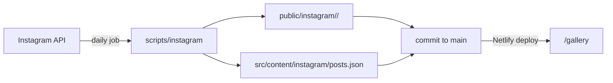

# Instagram gallery sync

The [`/gallery`](../src/app/gallery/page.tsx) page shows every post from
[@kizukuraudo](https://www.instagram.com/kizukuraudo/) in a three-column
grid, newest first. Nothing on the page talks to Instagram: the images,
videos, and captions are copies kept in this repo and served by Netlify
like any other static file. A GitHub Actions job keeps those copies current
once a day.

## How it fits together



- **Content lives in git.** The job commits new files and Netlify deploys
  them, so there's no database, storage bucket, or paid service, and a bad
  sync can be reverted like any other commit. The trade-off is that the repo
  grows with the archive (see [Limits](#limits-and-gaps)).
- **The page is static.** The first 24 posts are in the page's HTML. The
  rest are prebuilt as JSON chunks at `/gallery/posts/2`, `/gallery/posts/3`,
  and so on, and fetched as the reader scrolls.
- **Images are resized once, at sync time,** to WebP at 640 and 1440 pixels
  wide (never upscaled), with EXIF rotation applied. Videos are kept as
  downloaded, up to 50 MB.

Where things live:

- [`src/content/instagram/posts.json`](../src/content/instagram/posts.json):
  every post the gallery shows, keyed by Instagram media id.
- [`src/content/instagram/sync-state.json`](../src/content/instagram/sync-state.json):
  the last successful run, posts that keep failing, and known gaps.
- `public/instagram/<post id>/`: `0-640.webp` and `0-1440.webp` for each
  item, numbered in carousel order, plus `0.mp4` for videos.
- [`scripts/instagram/`](../scripts/instagram): the sync, token refresh, and
  export import, with their tests.
- [`.github/workflows/instagram-sync.yml`](../.github/workflows/instagram-sync.yml):
  the daily job.

## One-time setup

### 1. Switch the account to a Creator account

Instagram only offers its API to professional accounts. In the Instagram
app, open **Settings → Account type and tools → Switch to professional
account** and choose **Creator**.

What changes: the account has to be public, it gets insights and optional
profile contact buttons, and you can switch back at any time. Switching back
cuts off the API, so the daily sync would start failing; the gallery keeps
whatever it had already copied.

### 2. Create a Meta app

Meta renames these screens often, so treat the labels as a guide.

1. At [developers.facebook.com/apps](https://developers.facebook.com/apps),
   click **Create app**. Under the **Content management** filter, pick
   **Manage messaging & content on Instagram**, and don't connect a business
   portfolio.
2. In the use case's **Permissions and features**, add only
   `instagram_business_basic`. It's the one permission the sync uses: it
   reads your profile and posts and nothing else. Skip **Add all required
   permissions** on the setup page, which also adds comments and messages.
3. Under **App roles → Roles**, add @kizukuraudo as an **Instagram Tester**.
   Accept the invite at
   [instagram.com/accounts/manage_access](https://www.instagram.com/accounts/manage_access/)
   under **Tester invites**; the Instagram app often doesn't show it.
4. In **API setup with Instagram login**, under **Generate access tokens**,
   click **Add account** and sign in. Instagram's consent screen offers
   comments, messages, publishing, and insights too: switch all of them off,
   leaving only the required profile and media access.
5. Click **Generate token** next to the account and copy it. Meta shows it
   once; generate another if it's lost.

Leave the app in **Development** mode. App Review is only needed when other
people's accounts sign in, and here the only account is yours.

The generated token is long-lived: it lasts 60 days, and the daily job
refreshes it before it runs out.

### 3. Add the repo secrets

In GitHub, open the repo's **Settings → Secrets and variables → Actions**
and add:

- `INSTAGRAM_ACCESS_TOKEN`: the token from step 2, without quotes. GitHub
  stores secrets exactly as pasted.
- `SECRETS_PAT`: a fine-grained personal access token with access to this
  repo only and the **Secrets: Read and write** permission.

`SECRETS_PAT` lets the job save the refreshed token back into
`INSTAGRAM_ACCESS_TOKEN`. The job's built-in `GITHUB_TOKEN` can't write
secrets. Without `SECRETS_PAT` the sync still runs, but the stored token
expires 60 days after it was generated. Fine-grained tokens expire too, so
note the date you chose and replace it before then.

The token never belongs in the repo. Keep it in GitHub secrets, and locally
in the gitignored `.env.local`.

### 4. Run the first import

Copy [`.env.example`](../.env.example) to `.env.local` (or add the line to
your existing one) and paste the token in. Then preview, and import:

```sh
npm run instagram:sync -- --dry-run
npm run instagram:sync
```

The dry run lists what would be downloaded and writes nothing. The real run
downloads everything and prints a report, including any [gaps](#limits-and-gaps).
Check `/gallery` with `npm run dev`, then commit `src/content/instagram` and
`public/instagram`.

You can also skip the local run and start the workflow by hand (see
[Manual runs](#manual-runs)); it commits the import for you. That's the
better choice on a slow connection, since GitHub's runners do the
downloading.

### 5. Fill gaps from an Instagram export (optional)

Some posts can't be fetched through the API. A "Download your information"
export has their original files:

1. In Instagram, open **Accounts Center → Your information and permissions →
   Download your information**. Ask for your posts, in **JSON** format, at
   **High** media quality.
2. Unzip the download, then run:

   ```sh
   npm run instagram:import-export -- ~/Downloads/instagram-kizukuraudo-2026-10-05
   ```

By default this only imports posts recorded as `no-media` gaps. Add
`--include-missing` to import every exported post the gallery doesn't have,
such as archived posts the API never lists.

Exports carry no media ids, so posts are matched to the API's by publication
time and stored as `export-<unix seconds>`. Video posters are cut with
[ffmpeg](https://ffmpeg.org/) (`brew install ffmpeg`); without it, exported
videos are reported as failures and skipped. If the API later supplies a
post that was imported from the export, the API copy replaces it.

## Day to day

### The schedule

The job runs at 09:17 UTC every day. Each run:

1. Installs dependencies and runs the unit tests.
2. Refreshes the access token and saves it back to the repo secret. If the
   refresh fails, it carries on with the stored token.
3. Lists every post and downloads the new ones. Captions are refreshed on
   every run, and posts deleted from Instagram are deleted here too.
4. Commits `src/content/instagram` and `public/instagram` to `main` as
   `chore: main - sync instagram posts`, if anything changed. Netlify then
   deploys it.

Only one run happens at a time; a second one waits for the first to finish.

### Manual runs

In GitHub, open **Actions → Instagram sync → Run workflow**. Tick
**retry_failed** to retry posts that have failed five runs in a row.

Locally, `npm run instagram:sync` does the same sync without the commit.
Its options:

| Option            | Effect                                                |
| ----------------- | ----------------------------------------------------- |
| `--dry-run`       | Report what would change without writing anything     |
| `--retry-failed`  | Retry posts that have failed five runs in a row       |
| `--report <file>` | Also write the report to a file, as the workflow does |

### When it fails

A failed run opens an issue labelled `instagram-sync` with the run's report,
or comments on the one that's already open. The next successful run closes
it. The same report is on the run's summary page in Actions.

A run that fails partway still commits the posts it finished, including one
that hits the sync's 15-minute limit; the next run picks up the rest. A
post only appears in the gallery once all of its files are in place, so a
failed download never shows a broken post.

`sync-state.json` records what needs attention:

- **`lastSuccessAt`**: when a run last finished cleanly. On a quiet account
  it's still bumped once a week. That small commit keeps the repo active,
  since GitHub turns off scheduled workflows in repos with no activity for
  60 days.
- **`failures`**: posts that failed to download or process, with the error
  and how many runs in a row. After five, a post is skipped until a run
  with `--retry-failed`.
- **`gaps`**: posts the API listed but couldn't supply media for. The
  reasons are below.

### If the token expires

A token that's already expired can't be refreshed. This happens if the job
hasn't run for 60 days, or `SECRETS_PAT` was missing or expired. Generate a
new token in the Meta app (step 2 above) and replace the
`INSTAGRAM_ACCESS_TOKEN` secret, then run the workflow by hand.

## Limits and gaps

The Instagram API leaves some things out, and the sync records each missing
post rather than dropping it silently:

| Gap reason          | Cause                       | The gallery shows    |
| ------------------- | --------------------------- | -------------------- |
| `no-media`          | No media for a post or item | Nothing until filled |
| `video-unavailable` | Often licensed music        | Thumbnail and a link |
| `video-too-large`   | The video is over 50 MB     | Thumbnail and a link |

`no-media` covers a carousel with one unavailable item too: the whole post
waits, rather than showing with a hole in it. The thumbnail-only posts link
to Instagram to play the video.

Beyond gaps:

- **Stories and archived posts** aren't in the API at all. Archived posts can
  come from an export with `--include-missing`.
- **Only the newest 10,000 posts** are listed.
- **Alt text** set on Instagram is used where the API provides it. Otherwise
  the caption's first sentence, or the post date, stands in.
- **Repo size** grows with the archive: a few hundred KB per image post, plus
  any videos. GitHub warns about files over 50 MB, which is why longer
  videos aren't stored.
- **Export imports aren't mirrored.** The sync never deletes them, because
  the API can't confirm whether they still exist. To remove one, delete its
  entry from `posts.json`; the next sync deletes its files.

Meta's Platform Terms ask that copies of content stay in step with
Instagram, including deletions. The daily sync handles that for everything
it fetched.

## Tests

```sh
npm test          # unit and integration tests for the sync and data model
npm run test:e2e  # the gallery in Chromium, against fixture posts
```

`npm test` never touches the network: the API and downloads are faked, and
images are generated on the fly.

`npm run test:e2e` builds the site against
[`e2e/fixtures/instagram`](../e2e/fixtures/instagram) and serves stand-in
images, so it needs no token. That build replaces `.next`, so run
`npm run build` again before `npm start`. Install the browser once with
`npx playwright install chromium`.
